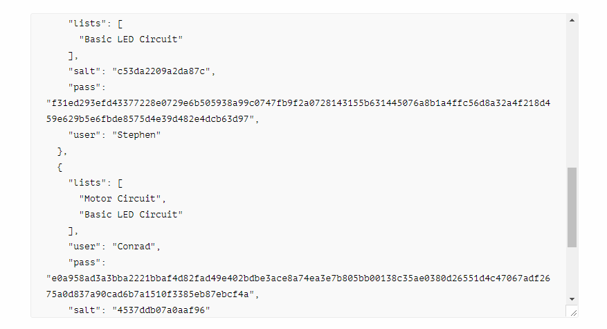

# RadioHack

This repository contains the code base for a hobby electronics project component list web app. Users can create a component list that can be viewed an edited by other authorized users.

## Resources
The [site](http://azuretest-yusuf.azurewebsites.net/) is hosted as an azure app service. The project's [scrum board](https://trello.com/b/S5OVDTdC/radiohack-scrum-board) is created in Trello. The [usernames and passwords](https://api.jsonbin.io/b/5afe0ac37a973f4ce578402e/latest) are stored on the jsonbin.io storage service for enhanced security. Use the secret key $2a$10$1HpPJq1WeTekrcJQSquSwegUqa1zQsIFKncdt7QC7oHIuLqua7vgW to access it. Refer to the documention for details on how it is implemented. The JSONBin API relies on HTTP Requests. In order to view the actual JSON data, console.log() functions are provided whenever a user is added to the system. A screenshot of the Database structure is provided.

## Usernames
Use usernames 'Stephen' and 'Conrad', with password 'admin'. To test shareability, create a list with either account. In the edit list screen there is a share option, where the username can be typed and the list shared. Once a list is shared, it will be accessible on any authorized accounts. The admin account has username and password 'admin', and has been granted access to all lists.

## Issues

On the homepage where lists are created or deleted, deleting a list will not automatically refresh the list of accessible lists. A work around requires that the refresh button be clicked upon deletion.

## Contributors
Created by Group 2.
